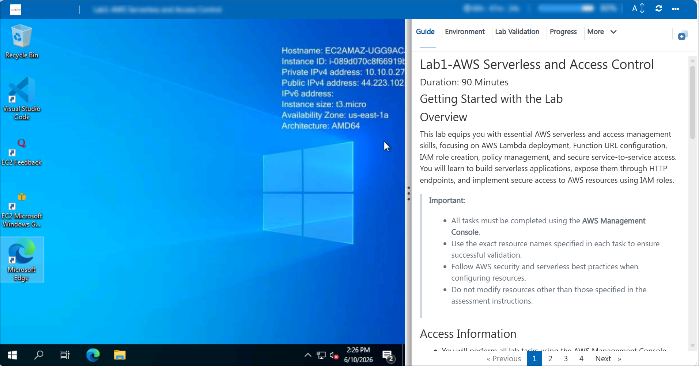
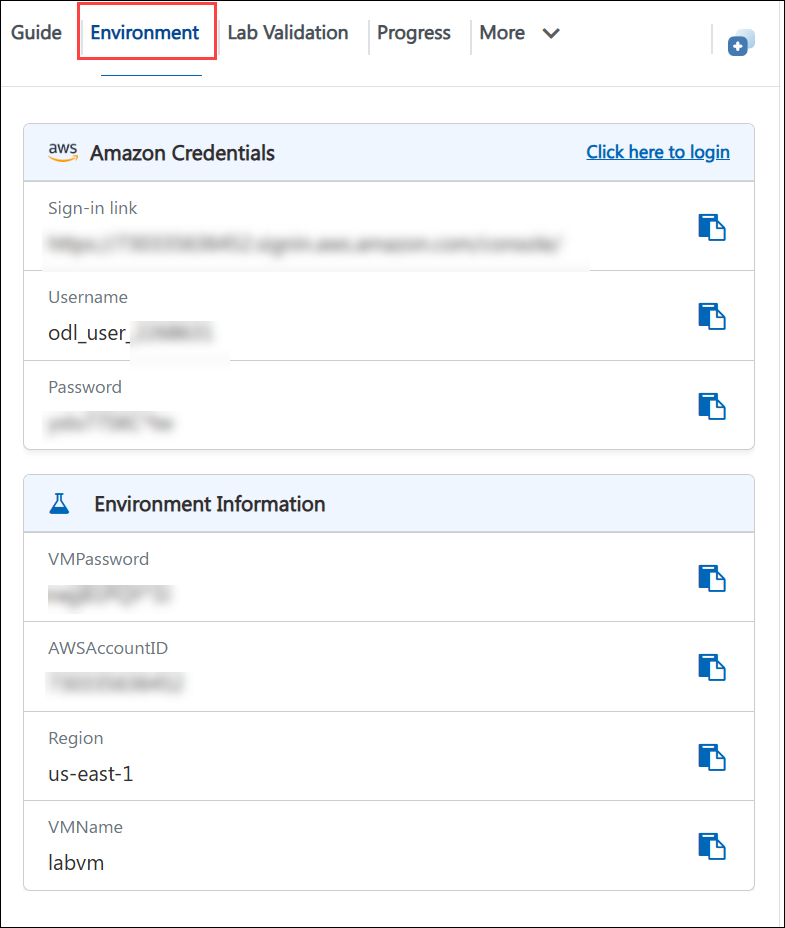
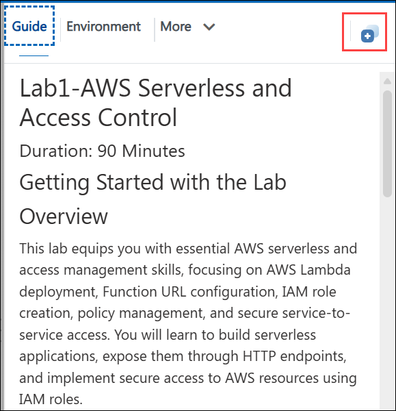
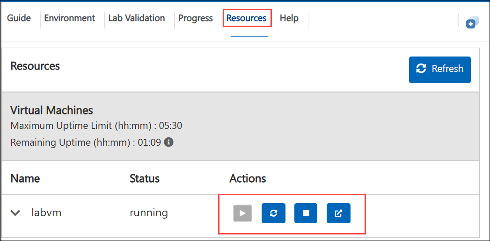
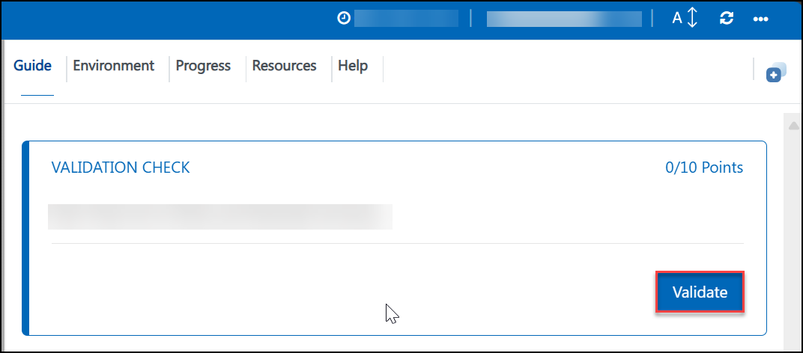
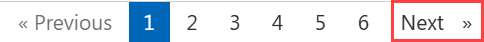

# **Lab1-AWS Serverless and Access Control**
### **Duration: 90 Minutes**
## **Getting Started with the Lab**

## **Overview**

This lab equips you with essential AWS serverless and access management skills, focusing on AWS Lambda deployment, Function URL configuration, IAM role creation, policy management, and secure service-to-service access. You will learn to build serverless applications, expose them through HTTP endpoints, and implement secure access to AWS resources using IAM roles.

> **Important:**
>
> * All tasks must be completed using the **AWS Management Console**.
> * Use the exact resource names specified in each task to ensure successful validation.
> * Follow AWS security and serverless best practices when configuring resources.
> * Do not modify resources other than those specified in the assessment instructions.

## **Access Information**

* You will perform all lab tasks using the AWS Management Console provided in this lab environment.
* The AWS account required for the assessment is preconfigured and accessible through your lab environment.
* All resources must be created and configured in the AWS region assigned to your lab session.
* Once you're ready to begin, access the AWS Management Console from your browser and follow the assessment objectives provided in the lab guide.
  
  

## **Exploring Your Lab Resources**

To get a better understanding of your lab resources and credentials, navigate to the Environment tab.
  
  

## **Utilizing the Split Window Feature**

For convenience, you can open the lab guide in a separate window by selecting the Split Window button from the Top right corner.
  
  
  
## **Managing Your Virtual Machine**

Feel free to Start, Restart, or Stop your virtual machine as needed from the Resources tab. Your experience is in your hands!

  

## **Lab Validation**

After completing the task, hit the Validate button under the Validation tab integrated within your lab guide. If you receive a success message, you can proceed to the next task; if not, carefully read the error message and retry the step, following the instructions in the lab guide.

  

## **Note**

All tasks in this lab are performed through the AWS Management Console provided in the lab environment.

* No SSH access or command-line connectivity is required.
* No local software installation is necessary.
* Use the AWS Management Console to create, configure, and validate all required resources.

> **Important:** Use the exact resource names specified in the assessment instructions. Validation is based on these names and configurations.

> **Note:** It is recommended to review resource settings carefully before saving changes, as validation checks both the existence and configuration of AWS resources.

## **Support Contact**

The CloudLabs support team is available 24/7, 365 days a year, via email and live chat to ensure seamless assistance at any time. We offer dedicated support channels tailored specifically for both learners and instructors, ensuring that all your needs are promptly and efficiently addressed.

Learner Support Contacts:

* Email Support: labs-support@spektrasystems.com
* Live Chat Support: https://cloudlabs.ai/labs-support

Now, click on Next >> from the lower right corner to move on to the next page.

